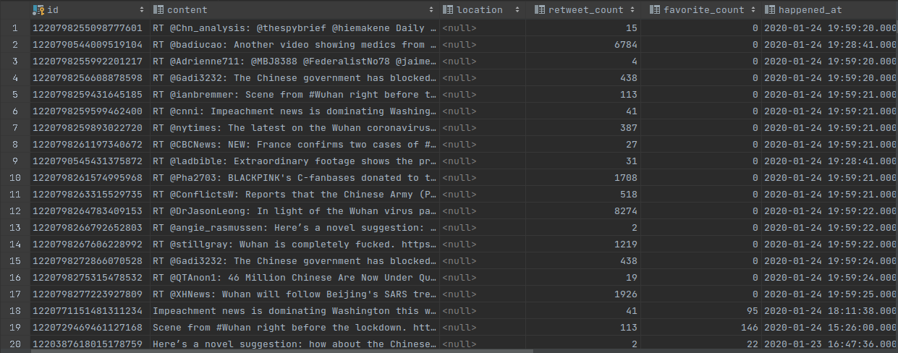
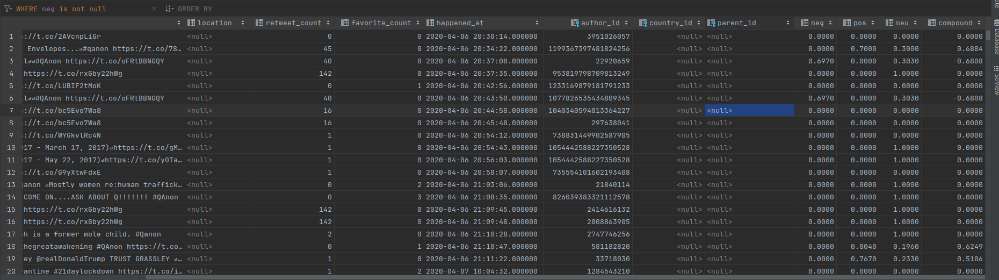
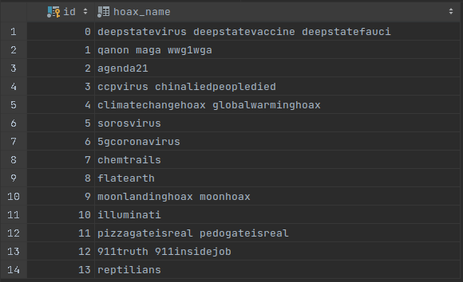
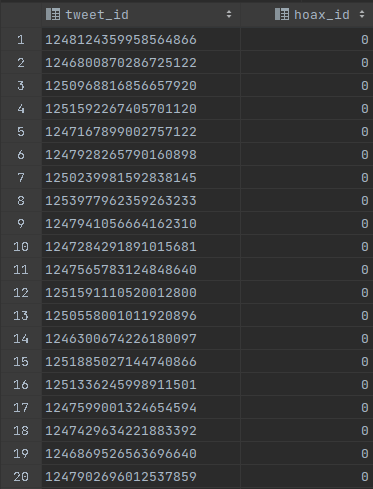
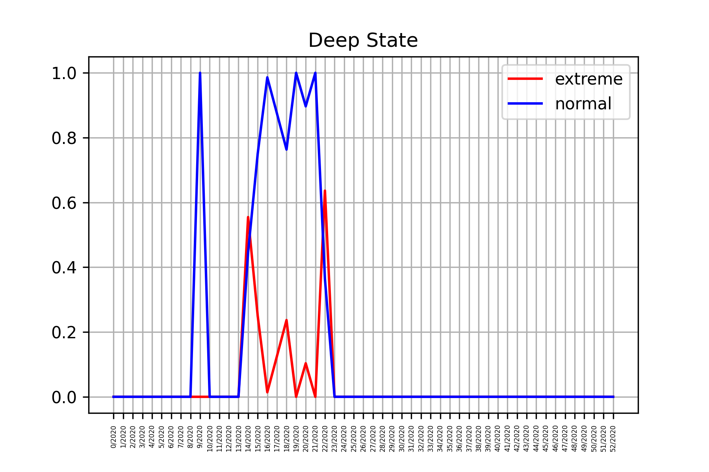

# Zadanie 1 – analýza tweetov

autor: Filip Agh
git: TODO

## uloha 1

___
pouzil som [docker container](https://registry.hub.docker.com/r/postgis/postgis)
import prikazom
```docker exec -i [container id] pg_restore -U postgres -v -d data < [path to tweets.backup]```

ukazka z tweets:


## uloha 2
___
zdrojak v `u2.ipynd`

TLTR:
spracoval som tagy
vytiahol som si list tweets_id tweetov ktore obsahuju pozadovane tagy
pouzil som pool z multiprocessing
kazdy proces dostane subset ids na spracovanie a pojednom to taha z db vypocita vader data a ulozi

pocet spracovanych unique tweets_id: 2152424

ukazka z tweets:


## uloha 3
___
zdrojak v `u3.ipynd`


TLTR:
vytvorenie tabuliek hoaxs, tweet_hoaxs
rozdelil som tagy do hoax teorii
insert do tabulky hoaxs
postupne pre kazdu skupinu hoaxov vyhladam tweety ktore obsahuju tag a nasledne ich pridam do tabulky tweet_hoaxs


ukazka z hoaxs:


ukazka z tweet_hoaxs:


## uloha 4
___
zdrojak v `u4.ipynd`


TLTR:
definovanie hoaxov
vytvorenie in memory struktura na tabulku udajov tyzden/rok, extrem, normal, total
select na pocet tweet count podla tyzdna a roku
vpisanie udajov z DB do pradznej generovanej tabulkovaj struktury
render grafov a ulozenie do csv

vysledky su v priecinku [result](result/)

priklad:


## uloha 5,6
___
zdrojak v `u5.ipynd`

obsahuje len samotny select ktory bol exportovany do csv v [result/statistika](result/statistika)
